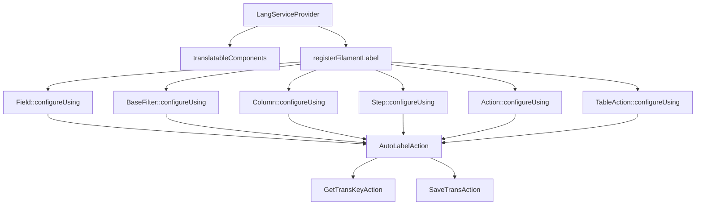

<<<<<<< HEAD
<<<<<<< HEAD
<<<<<<< HEAD
# LangServiceProvider: Analisi e Proposte di Miglioramento

## Analisi dell'Implementazione Attuale
<<<<<<< HEAD

<<<<<<< HEAD
Il `LangServiceProvider` è un componente fondamentale di <nome progetto> che gestisce automaticamente le traduzioni per i componenti Filament senza richiedere l'uso esplicito del metodo `->label()`. Questo approccio garantisce:
=======
Il `LangServiceProvider` è un componente fondamentale di  che gestisce automaticamente le traduzioni per i componenti Filament senza richiedere l'uso esplicito del metodo `->label()`. Questo approccio garantisce:
>>>>>>> 9ce799e (Check & fix styling)

=======
Il `LangServiceProvider` è un componente fondamentale di  che gestisce automaticamente le traduzioni per i componenti Filament senza richiedere l'uso esplicito del metodo `->label()`. Questo approccio garantisce:
>>>>>>> 9059f82 (.)
1. **Coerenza**: Tutte le etichette seguono lo stesso pattern di traduzione
2. **Manutenibilità**: Le traduzioni sono centralizzate nei file di lingua
3. **Automazione**: Le chiavi di traduzione mancanti vengono create automaticamente
### Architettura Attuale
=======
# LangServiceProvider: Analisi e Proposte di Miglioramento

## Analisi dell'Implementazione Attuale

Il `LangServiceProvider` è un componente fondamentale di  che gestisce automaticamente le traduzioni per i componenti Filament senza richiedere l'uso esplicito del metodo `->label()`. Questo approccio garantisce:

1. **Coerenza**: Tutte le etichette seguono lo stesso pattern di traduzione
2. **Manutenibilità**: Le traduzioni sono centralizzate nei file di lingua
3. **Automazione**: Le chiavi di traduzione mancanti vengono create automaticamente

### Architettura Attuale

>>>>>>> 1bb26ee (.)

<<<<<<< HEAD
### Flusso di Funzionamento
=======

### Flusso di Funzionamento

>>>>>>> 1bb26ee (.)
1. Il componente Filament viene creato
2. `LangServiceProvider` intercetta la creazione attraverso `configureUsing`
3. `AutoLabelAction` determina la classe che sta istanziando il componente
4. Genera una chiave di traduzione basata sulla classe e sul nome del componente
5. Cerca la traduzione nei file di lingua
6. Se la traduzione non esiste, la salva automaticamente
7. Applica la traduzione al componente
<<<<<<< HEAD
### Struttura Chiavi di Traduzione
=======

### Struttura Chiavi di Traduzione

>>>>>>> 1bb26ee (.)
- **Campi form**: `modulo::risorsa.fields.nome_campo.label`
- **Azioni**: `modulo::risorsa.actions.nome_azione.label`
- **Passi wizard**: `modulo::risorsa.steps.nome_passo.label`
- **Altri attributi**: `.placeholder`, `.helperText`, `.description`
<<<<<<< HEAD
## Implementazione Attuale
Il file principale del provider si trova in:
<<<<<<< HEAD
`/var/www/html/<nome progetto>/laravel/Modules/Lang/app/Providers/LangServiceProvider.php`

L'azione principale che gestisce l'etichettatura automatica è:
`/var/www/html/<nome progetto>/laravel/Modules/Lang/app/Actions/Filament/AutoLabelAction.php`
=======
`/var/www/html/_bases/base_techplanner_fila3_mono/laravel/Modules/Lang/app/Providers/LangServiceProvider.php`
L'azione principale che gestisce l'etichettatura automatica è:
`/var/www/html/_bases/base_techplanner_fila3_mono/laravel/Modules/Lang/app/Actions/Filament/AutoLabelAction.php`
<<<<<<< HEAD
>>>>>>> 9ce799e (Check & fix styling)

=======
>>>>>>> 9059f82 (.)
### Esempio di Utilizzo Corretto
=======

## Implementazione Attuale

Il file principale del provider si trova in:
`/var/www/html/_bases/base_techplanner_fila3_mono/laravel/Modules/Lang/app/Providers/LangServiceProvider.php`

L'azione principale che gestisce l'etichettatura automatica è:
`/var/www/html/_bases/base_techplanner_fila3_mono/laravel/Modules/Lang/app/Actions/Filament/AutoLabelAction.php`

### Esempio di Utilizzo Corretto

>>>>>>> 1bb26ee (.)
```php
// CORRETTO: Non specificare label, viene gestito automaticamente
TextInput::make('name')
    ->required()
    ->maxLength(255)
<<<<<<< HEAD
// ERRATO: Non utilizzare ->label() nei componenti
    ->label('Nome')  // ❌ Non fare questo!
## Proposte di Miglioramento
### 1. Estensione Supporto Componenti (Priorità: Alta)
Attualmente il sistema supporta `Field`, `BaseFilter`, `Column`, `Step`, `Action` e `TableAction`. Propongo di estendere il supporto a:
// Modules/Lang/app/Providers/LangServiceProvider.php
=======

// ERRATO: Non utilizzare ->label() nei componenti
TextInput::make('name')
    ->label('Nome')  // ❌ Non fare questo!
    ->required()
    ->maxLength(255)
```

## Proposte di Miglioramento

### 1. Estensione Supporto Componenti (Priorità: Alta)

Attualmente il sistema supporta `Field`, `BaseFilter`, `Column`, `Step`, `Action` e `TableAction`. Propongo di estendere il supporto a:

```php
// Modules/Lang/app/Providers/LangServiceProvider.php

>>>>>>> 1bb26ee (.)
protected function translatableComponents(): void
{
    $components = [
        Field::class, 
        BaseFilter::class, 
        Placeholder::class, 
        Column::class, 
        Entry::class,
        // Nuovi componenti da supportare
        Section::class,                // Sezioni form
        Tabs\Tab::class,               // Tab nei form
        Fieldset::class,               // Fieldset nei form
        ViewField::class,              // ViewField per componenti custom
        Navigation\NavigationItem::class, // Item di navigazione
        Infolists\Components\TextEntry::class, // Componenti Infolist
    ];
    // Resto del codice invariato
}
<<<<<<< HEAD
### 2. Ottimizzazione Cache Traduzioni (Priorità: Media)
Migliorare le performance attraverso un sistema di cache delle chiavi di traduzione per evitare ricerche ripetute:
// Modules/Lang/app/Actions/Filament/AutoLabelAction.php
use Illuminate\Support\Facades\Cache;
class AutoLabelAction
=======
```

### 2. Ottimizzazione Cache Traduzioni (Priorità: Media)

Migliorare le performance attraverso un sistema di cache delle chiavi di traduzione per evitare ricerche ripetute:

```php
// Modules/Lang/app/Actions/Filament/AutoLabelAction.php

use Illuminate\Support\Facades\Cache;

class AutoLabelAction
{
    // Resto del codice invariato
>>>>>>> 1bb26ee (.)
    
    protected function getTranslation(string $key, string $default): string
    {
        // Chiave cache con namespacing appropriato
        $cacheKey = 'lang_service_provider:' . $key;
        
        // Cache per 24 ore, oppure fino al prossimo deploy
        return Cache::remember($cacheKey, now()->addHours(24), function () use ($key, $default) {
            $translation = trans($key);
            
            // Se la traduzione non esiste, la salviamo e restituiamo il default
            if ($translation === $key) {
                app(SaveTransAction::class)->execute($key, $default);
                return $default;
            }
<<<<<<< HEAD
            return $translation;
        });
    }
### 3. Supporto per Enum nei Select (Priorità: Alta)
Aggiungere supporto automatico per la traduzione delle opzioni degli enum nei componenti Select:
protected function translateEnumOptions(Forms\Components\Select $component, string $enumClass): void
=======
            
            return $translation;
        });
    }
}
```

### 3. Supporto per Enum nei Select (Priorità: Alta)

Aggiungere supporto automatico per la traduzione delle opzioni degli enum nei componenti Select:

```php
// Modules/Lang/app/Actions/Filament/AutoLabelAction.php

protected function translateEnumOptions(Forms\Components\Select $component, string $enumClass): void
{
>>>>>>> 1bb26ee (.)
    // Otteniamo la chiave di traduzione base
    $backtrace = debug_backtrace(DEBUG_BACKTRACE_IGNORE_ARGS, 10);
    $modClass = $this->findModuleClass($backtrace);
    $baseKey = app(GetTransKeyAction::class)->execute($modClass);
<<<<<<< HEAD
=======
    
>>>>>>> 1bb26ee (.)
    // Se è un enum PHP 8.1+
    if (enum_exists($enumClass)) {
        $options = [];
        foreach ($enumClass::cases() as $case) {
            $transKey = "{$baseKey}.enums." . class_basename($enumClass) . "." . $case->name;
            $options[$case->value] = trans($transKey, [], $case->name);
<<<<<<< HEAD
            // Salva la traduzione se non esiste
            if (trans($transKey) === $transKey) {
                app(SaveTransAction::class)->execute($transKey, $case->name);
        }
        $component->options($options);
### 4. Interfaccia di Gestione Traduzioni (Priorità: Bassa)
Sviluppare un pannello di amministrazione per gestire le traduzioni mancanti o errate:
// Modules/Lang/app/Filament/Resources/TranslationResource.php
class TranslationResource extends XotBaseResource
    protected static ?string $model = Translation::class;
    protected static ?string $navigationIcon = 'heroicon-o-language';
    public static function getFormSchema(): array
=======
            
            // Salva la traduzione se non esiste
            if (trans($transKey) === $transKey) {
                app(SaveTransAction::class)->execute($transKey, $case->name);
            }
        }
        
        $component->options($options);
    }
}
```

### 4. Interfaccia di Gestione Traduzioni (Priorità: Bassa)

Sviluppare un pannello di amministrazione per gestire le traduzioni mancanti o errate:

```php
// Modules/Lang/app/Filament/Resources/TranslationResource.php

class TranslationResource extends XotBaseResource
{
    protected static ?string $model = Translation::class;
    
    protected static ?string $navigationIcon = 'heroicon-o-language';
    
    public static function getFormSchema(): array
    {
>>>>>>> 1bb26ee (.)
        return [
            'key' => TextInput::make('key')
                ->disabled()
                ->columnSpan(2),
                
            'it' => TextInput::make('it')
                ->label('Italiano'),
<<<<<<< HEAD
            'en' => TextInput::make('en')
                ->label('English'),
=======
                
            'en' => TextInput::make('en')
                ->label('English'),
                
>>>>>>> 1bb26ee (.)
            'status' => Select::make('status')
                ->options([
                    'auto' => 'Generata automaticamente',
                    'verified' => 'Verificata',
                    'needs_review' => 'Da rivedere',
                ])
        ];
<<<<<<< HEAD
## Conclusioni e Raccomandazioni
Il `LangServiceProvider` è un componente essenziale che garantisce coerenza nelle traduzioni dell'interfaccia utente. Le migliorie proposte mirano a:
=======
    }
}
```

## Conclusioni e Raccomandazioni

Il `LangServiceProvider` è un componente essenziale che garantisce coerenza nelle traduzioni dell'interfaccia utente. Le migliorie proposte mirano a:

>>>>>>> 1bb26ee (.)
1. Estendere il supporto a più componenti Filament
2. Migliorare le performance con un sistema di cache
3. Aggiungere supporto nativo per gli enum
4. Fornire strumenti di gestione per le traduzioni
<<<<<<< HEAD
L'implementazione di queste migliorie permetterebbe di:
=======

L'implementazione di queste migliorie permetterebbe di:

>>>>>>> 1bb26ee (.)
- Ridurre il tempo di sviluppo
- Migliorare la coerenza dell'interfaccia
- Facilitare la manutenzione delle traduzioni
- Supportare meglio l'internazionalizzazione dell'applicazione
<<<<<<< HEAD
### Prossimi Passi
=======

### Prossimi Passi

>>>>>>> 1bb26ee (.)
1. Implementare l'estensione del supporto ai componenti (1-2 giorni)
2. Aggiungere il sistema di cache (1 giorno)
3. Sviluppare il supporto per gli enum (2-3 giorni)
4. Creare l'interfaccia di gestione traduzioni (3-5 giorni)
## Gestione dei Console Commands
<<<<<<< HEAD
### Autoregistrazione (Filosofia Xot)
Tutti i comandi console del modulo vengono autoregistrati tramite la classe base `XotBaseServiceProvider`.
**Non è mai necessario (né consentito) registrarli manualmente** con `$this->commands([...])`.
=======

### Autoregistrazione (Filosofia Xot)

Tutti i comandi console del modulo vengono autoregistrati tramite la classe base `XotBaseServiceProvider`.

**Non è mai necessario (né consentito) registrarli manualmente** con `$this->commands([...])`.

>>>>>>> 1bb26ee (.)
#### Motivazione (Zen, Religione, Politica, Filosofia)
- **Zen**: meno codice, meno errori, più armonia.
- **Religione**: la via Xot è una sola, non si devia dal sentiero.
- **Politica**: la centralizzazione evita conflitti e garantisce coerenza tra i moduli.
- **Filosofia**: la ripetizione è il male, l'automazione è il bene.
<<<<<<< HEAD
#### Esempio Sbagliato
=======

#### Esempio Sbagliato
```php
>>>>>>> 1bb26ee (.)
// NON FARE MAI!
$this->commands([
    \Modules\Lang\Console\Commands\ConvertTranslations::class,
    \Modules\Lang\Console\Commands\FindMissingTranslations::class,
]);
<<<<<<< HEAD
#### Esempio Corretto
// Non serve fare nulla: XotBaseServiceProvider li registra automaticamente.
#### Warning
> Qualsiasi registrazione manuale dei comandi console è considerata un errore grave e va rimossa.
### Approfondimento
Per dettagli tecnici, vedi anche la documentazione di `XotBaseServiceProvider` e le best practice nei file correlati.
Il `
# LangServiceProvider
## Introduzione
Il LangServiceProvider è un componente fondamentale per la gestione delle traduzioni nell'applicazione SaluteOra. Questo documento fornisce una panoramica del sistema di traduzioni e collega alla documentazione dettagliata nel modulo Lang.
## Caratteristiche Principali
=======
# LangServiceProvider

## Introduzione

Il LangServiceProvider è un componente fondamentale per la gestione delle traduzioni nell'applicazione SaluteOra. Questo documento fornisce una panoramica del sistema di traduzioni e collega alla documentazione dettagliata nel modulo Lang.

## Caratteristiche Principali

>>>>>>> d5fc9cd (.)
1. **Gestione Traduzioni**
   - Supporto multilingua
   - Caching efficiente
   - Validazione automatica
   - Fallback intelligente
<<<<<<< HEAD
=======

>>>>>>> d5fc9cd (.)
2. **Integrazione Moduli**
   - Namespace per modulo
   - Auto-discovery traduzioni
   - Gestione centralizzata
<<<<<<< HEAD
=======

>>>>>>> d5fc9cd (.)
3. **Performance**
   - Cache Redis
   - Lazy loading
   - Ottimizzazione memoria
<<<<<<< HEAD
## Collegamenti alla Documentazione
Per una documentazione dettagliata sulle implementazioni e miglioramenti del LangServiceProvider, consultare:
- [Miglioramenti LangServiceProvider](../laravel/Modules/Lang/docs/lang-service-provider-improvements.md)
- [Guida Implementazione](../laravel/Modules/Lang/docs/implementation-guide.md)
- [Best Practices](../laravel/Modules/Lang/docs/best-practices.md)
## Utilizzo Base
// Traduzioni generiche
__('common.welcome')  // "Benvenuto"
// Traduzioni modulo specifico
__('dentist.registration.title')  // "Registrazione Odontoiatra"
__('patient.registration.title')  // "Registrazione Paziente"
=======

## Collegamenti alla Documentazione

Per una documentazione dettagliata sulle implementazioni e miglioramenti del LangServiceProvider, consultare:

- [Miglioramenti LangServiceProvider](../laravel/Modules/Lang/docs/lang-service-provider-improvements.md)
- [Guida Implementazione](../laravel/Modules/Lang/docs/implementation-guide.md)
- [Best Practices](../laravel/Modules/Lang/docs/best-practices.md)

## Utilizzo Base

```php
// Traduzioni generiche
__('common.welcome')  // "Benvenuto"

// Traduzioni modulo specifico
__('dentist.registration.title')  // "Registrazione Odontoiatra"
__('patient.registration.title')  // "Registrazione Paziente"
```

>>>>>>> d5fc9cd (.)
## Note Tecniche
- Utilizzare Redis per il caching
- Implementare validazione delle chiavi
- Gestire fallback locale
- Supportare namespace personalizzati
- Ottimizzare performance
<<<<<<< HEAD
=======
>>>>>>> 121b362 (.)
=======
>>>>>>> d5fc9cd (.)
=======
```

#### Esempio Corretto
```php
// Non serve fare nulla: XotBaseServiceProvider li registra automaticamente.
```

#### Warning
> Qualsiasi registrazione manuale dei comandi console è considerata un errore grave e va rimossa.

### Approfondimento
Per dettagli tecnici, vedi anche la documentazione di `XotBaseServiceProvider` e le best practice nei file correlati.

## Conclusioni e Raccomandazioni

Il `
>>>>>>> 1bb26ee (.)
